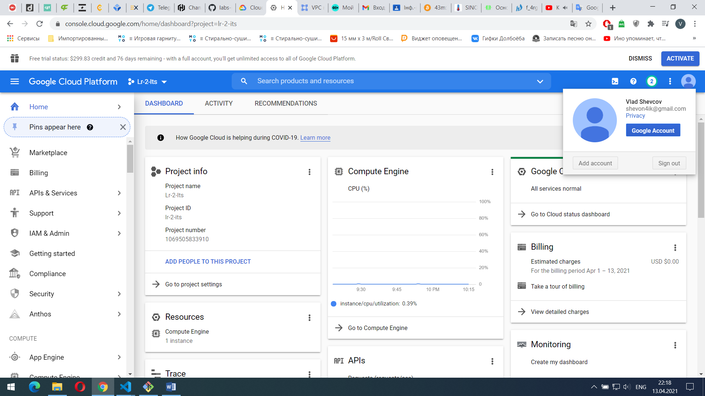
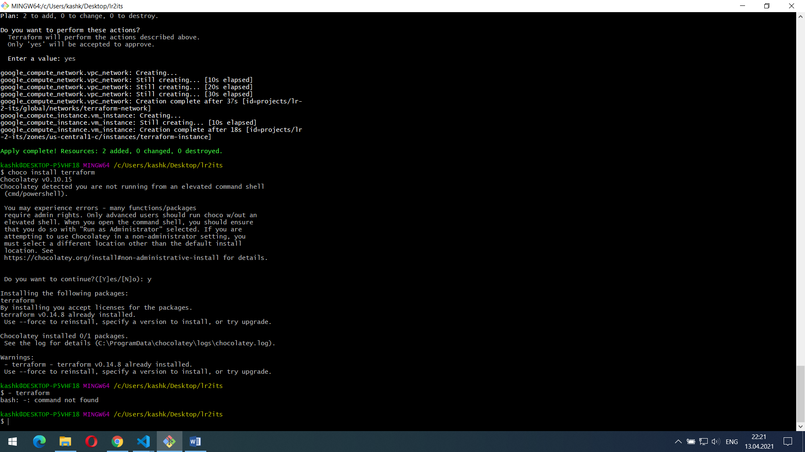
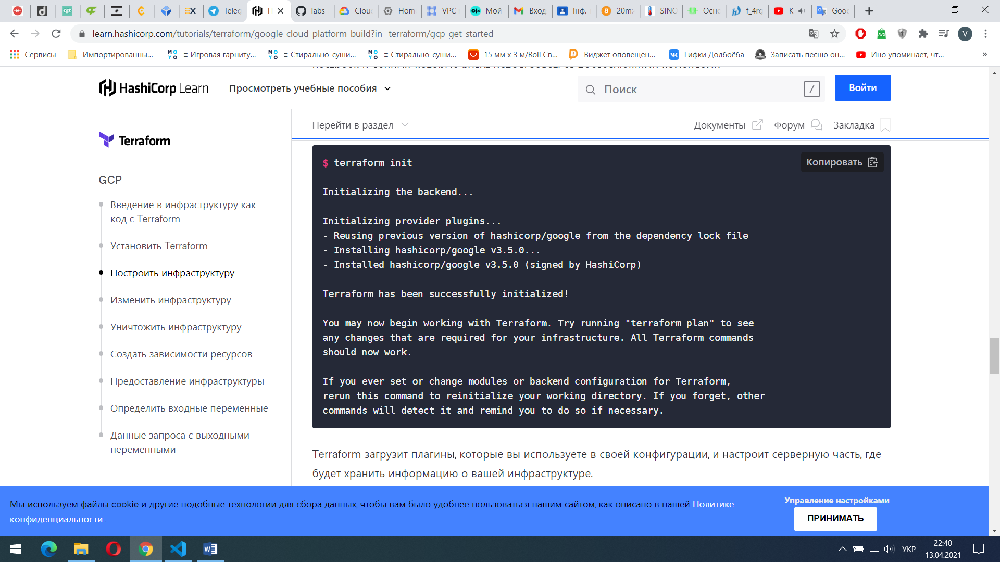
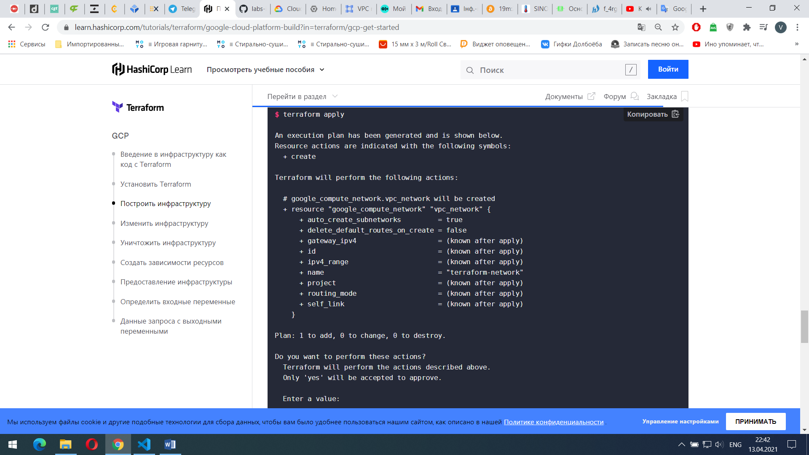

МІНІСТЕРСТВО ОСВІТИ І НАУКИ УКРАЇНИ

Національний аерокосмічний університет ім. М. Є. Жуковського «Харківський авіаційний інститут»

Факультет «Радіоелектроніки, комп’ютерних систем та інфокомунікацій» Кафедра «Аерокосмічних радіоелектронних систем»  

**Лабораторна робота №2**

з дисципліни «Інформаційно-комунікаційні мережі » 

на тему: «Основи роботи з Terraform»

Виконав: студент 4 курсу групи № 536-ст напряму підготовки (спеціальності) 172 «Телекомунікації та радіотехніка»  Шевцов В.В

Прийняв: ас. каф. 501  

Перетятько М. С.  

Національна шкала:  

Кількість балів:  

Оцінка: ECTS  

Харків 2021 

**Ціль роботи:** Навчитися роботі у Terraform та створення облікового запису у GCP.

ХІД РОБОТИ 

1)Створили обліковий запис у GCP

Рисунок 1 – Обліковий запис у GCP

\2) Встановив Terraform за допомогою команди choco install terraform

Рисунок 2 – Установлення Terraform

\3) Створюємо каталог для прикладів в цьому керівництві і всередині нього збережіть наведений нижче приклад конфігурації в файл з ім'ям main.tf

terraform {

`  `required\_providers {

`    `google = {

`      `source = "hashicorp/google"

`      `version = "3.5.0"

`    `}

`  `}

}

provider "google" {

`  `credentials = file("<NAME>.json")

`  `project = "<PROJECT\_ID>"

`  `region  = "us-central1"

`  `zone    = "us-central1-c"

}

resource "google\_compute\_network" "vpc\_network" {

`  `name = "terraform-network"

}

\4) Ініціалізіруємо нову конфігурацію Terraform, запустивши terraform init команду в тому ж каталозі, що і ваш main.tf файл.

Рисунок 3 – Ініціалізація конфігурації Terraform

\5) Cтворення ресурсів за допомогою команди terraform apply

Рисунок 4 – Створення ресурсів

\6) Додавання ресурсів

У файл main.tf додаємо данні команди 

resource "google\_compute\_instance" "vm\_instance" {

`  `name         = "terraform-instance"

`  `machine\_type = "f1-micro"

`  `boot\_disk {

`    `initialize\_params {

`      `image = "debian-cloud/debian-9"

`    `}

`  `}

`  `network\_interface {

`    `network = google\_compute\_network.vpc\_network.name

`    `access\_config {

`    `}

`  `}

}

terraform apply і yes

\7) Для зміни ресурсів ми вписуємо данну команду

` `+ tags         = ["web", "dev"]

\8) Ресурси можуть бути знищені за допомогою terraform destroy

ВИСНОВКИ 

В данній лабораторній роботі було виконано маніпуляції з GCP, а саме ми навчилися створювати обліковий запис на GCP. Навчився працювати з terraform. Також встановили за допомогою CHOCOLATEY terraform. Навчилися додавати, редагувати, та знищувати ресурси.

