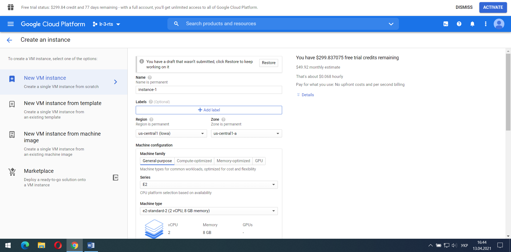

МІНІСТЕРСТВО ОСВІТИ І НАУКИ УКРАЇНИ

Національний аерокосмічний університет ім. М. Є. Жуковського «Харківський авіаційний інститут»

Факультет «Радіоелектроніки, комп’ютерних систем та інфокомунікацій» Кафедра «Аерокосмічних радіоелектронних систем»  

**Лабораторна робота №3**

з дисципліни «Інформаційно-комунікаційні мережі » 

на тему: «Створення віртуальної машини з операційною системою лінукс»

Виконав: студент 4 курсу групи № 536-ст напряму підготовки (спеціальності) 172 «Телекомунікації та радіотехніка»  Шевцов В.В

Прийняв: ас. каф. 501  

Перетятько М. С.  

Національна шкала:  

Кількість балів:  

Оцінка: ECTS  

Харків 2021 

**Ціль роботи:** Створити віртуальну машину з операційною системою лінукс.  

ХІД РОБОТИ 

1) Cтворюємо новий проект у GCP

1) Створив VPC

3)Створюємо віртуальну машину з операційною системою лінукс

\4) Виконуємо команди з сайта <https://www.jenkins.io/doc/book/installing/linux/#debianubuntu>

А саме:

Встановлюємо Jenkins

Оновлюємо репозиторій

sudo apt update

Встановлюємо openjdk

sudo apt install openjdk

Запустив службу Jenkins за допомогою команди:

sudo systemctl start jenkins

Розблукування Jenkins

Для цього пишемо команду sudo cat /var/lib/jenkins/secrets/initialAdminPassword і в командному вікні буде пароль

І ось ми маємо створений Jenkins

ВИСНОВКИ 

В данній лабораторній роботі було виконано маніпуляції з cтворенням віртуальної машини з операційною системою лінукс. За допомогою GCP ми створили VPC і віртуальну машину. Навчився працювати з Google cloud, а також встановлювати і запускати Jenkins.

